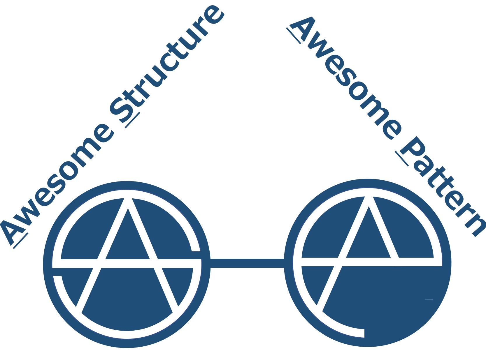

  

## Awesome Structure Awesome Pattern (AsAp)  []

A toolkit to mine Awesome Pattern from Awesome Strcuture. Upon some widely adopted structured-based recommendation methods, we propose a series of plug-in modules: (i) AngelRec: enhancing the recommendation performance by pre-defined logics (so called metapath), (ii) HingeRec: enhancing the recommendation performance by interaction modules (especially convolution operations), (iii) StaRec: enhancing the recommendation performance by searching and retrieving relevant data, (iv) LabelRec: enhancing the recommendation performance by parallel use of features and labels.

## Contributing to AsAp
AsAp is a brandnew project, and we are actively accepting code contributions to the AsAp project. If you are interested in contributing to AsAp, please contact Jiarui Jin (Email: jinjiarui97 [AT] gmail.com). 

